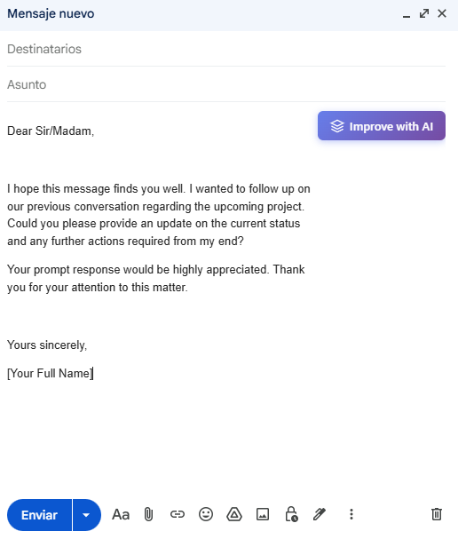
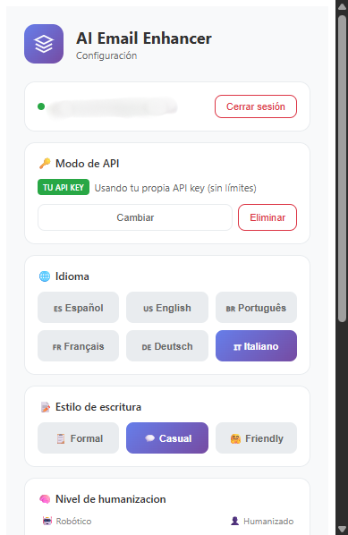

# AI Email Enhancer ✨

¿Tus emails necesitan un empujón? Esta extensión te ayuda a redactar mejor, corregir faltas ortográficas, traducir a diferentes idiomas y escribir de forma más clara y profesional — sin perder tiempo.

## Lo que hace

Mejora tus borradores corrigiendo faltas ortográficas, mejorando la estructura y el tono. Ya sea que necesites un email formal para tu jefe, uno amigable para un cliente, o simplemente algo más claro y profesional.

## Características principales

### 📝 Estilos de escritura

Elige el tono perfecto para cada situación:

- **Formal** — Para cuando necesitas profesionalismo extremo
- **Profesional** — Equilibrio perfecto para el trabajo diario
- **Amigable** — Cálido y cercano, sin perder seriedad
- **Casual** — Como le escribirías a un compañero

### 🧠 Humanización inteligente

Controla cuánto "humano" suena tu email.

- 0% = Textos generados y robóticos
- 100% = Suenan como si los hubieras escrito tú mismo

### 🌍 Traducción y multilingüe

Escribe en tu idioma y tradúcelo al instante. Soporta español, inglés, portugués, francés, alemán e italiano.

### ✨ Toques personales

- **Emojis**: Agrega vida y personalidad a tus mensajes
- **Firma automática**: Saludo y despedida incluidos

### 📏 Control de longitud

Ajusta la extensión máxima según tus necesidades.

## Cómo usarla

1. **Instálala** desde la Chrome Web Store
2. **Inicia sesión** con tu cuenta (o crea una gratis)
3. **Escribe** tu email en cualquier campo de texto
4. **Dale magia** — la extensión lo mejora automáticamente

También puedes configurar todo desde el popup de la extensión:

## Demo

Mira la extensión en acción mejorando emails en tiempo real:

## Requisitos

- Chrome, Edge o Brave (extensión compatible con Manifest V3)
- Una cuenta (gratis) para autenticar

## Desarrollada con

- [Plasmo](https://docs.plasmo.com/) — Framework para extensiones
- React + TypeScript
- Supabase — Autenticación y backend
